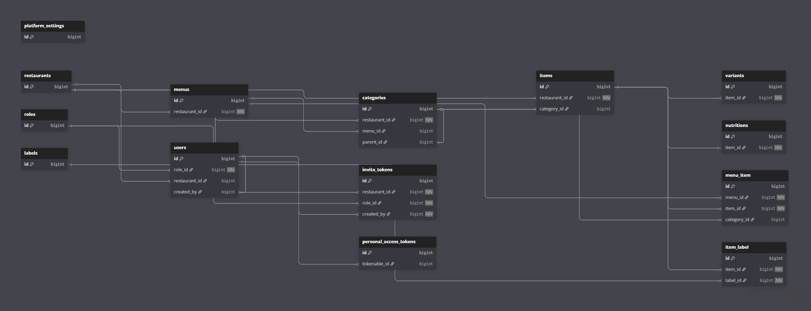

<div align="center">

# QR Menu

> Multi-tenant SaaS platform for digital restaurant menus — owners manage bilingual menus via an admin panel, customers browse by scanning a QR code with no login required.


<!-- [Live Demo](#) · [API Docs](#) -->

</div>

---

## Overview

QR Menu is a multi-tenant SaaS platform that replaces physical menus with a digital QR-based experience. Restaurant owners get a full admin panel to manage items, categories, menus, variants, and nutritional info in Arabic and English. Customers scan the QR code and instantly browse the menu on their phone — no app install, no account.

The platform supports multiple restaurants from a single deployment, with a platform owner dashboard for centralized restaurant and user management. Multi-tenancy is enforced through a middleware pipeline, role-based access spans three user roles, and bilingual (AR/EN) support is built into every layer — from validation rules to error messages.

<!-- ---

## Screenshots

| View | Preview |
|------|---------|
| Platform Dashboard |  |
| Owner Admin Panel |  |
| Menu Management |  |
| Customer Menu |  | -->

---

## Features

**Platform Owner**
- Full platform visibility: live stats dashboard with active restaurant count, total users, and a 12-month registration chart
- User management across all tenants: search, filter by role/status, view account activity, activate/deactivate accounts
- Onboard new restaurants and issue one-time staff invite links with role assignment
- Configure global platform settings: name, default language, logo
- Full access to the platform with a dedicated role that bypasses tenant-level restrictions

**Restaurant Owner**
- Run multiple independent menus simultaneously (Ramadan menu, lunch menu, branch-specific menus)
- Each item supports: bilingual name + description, image (auto-converted to WebP), base price, size variants with individual pricing, full nutritional breakdown (calories, protein, carbs, fat), tags (vegan, keto, spicy, new…), and allergen warnings (nuts, gluten, lactose…)
- Organize categories in a two-tier drag-and-drop hierarchy — reorder anything without retyping
- Per-restaurant menu identity: brand colors, 12 bilingual fonts (Arabic + English), and 3 card layout presets — every restaurant looks completely distinct
- Generate and download print-ready QR codes per restaurant and per menu as PNG
- Toggle any item, category, or menu on/off instantly without deleting

**Customer (Public)**
- Scan QR → full menu loads instantly — no app download, no account, zero friction
- Glassmorphism UI with the restaurant's cover photo as a living blurred background — every menu feels branded, not generic
- Restaurant landing page shows description, all active menus, and a direct contact bar (phone, WhatsApp, Instagram, Facebook, TikTok, website) — one tap to call or message
- Two-tier sticky category navigation — tap a parent to jump sections, tap a child to filter within them
- Search by item name + filter by dietary tags in real time
- Item detail sheet: full image, bilingual name + description, size selector with live price update, allergen warnings, tags, and expandable nutrition facts

---

## System Architecture

### High-Level Design

```
Customer (Mobile Browser)
        │  QR Scan → no login required
        ▼
React 19 SPA (Vite + TypeScript + Tailwind v4)
        │  REST API calls (/api/v1/...)
        │  Sanctum Bearer token for admin routes only
        ▼
Laravel 12 REST API
        ├── Auth (Sanctum v4 — token expiry, rate limiting)
        ├── Multi-Tenancy (owns.restaurant middleware)
        ├── Role-Based Access (platform_owner | owner | waiter)
        ├── Menu & Category Management
        ├── Image Pipeline (Intervention/Image v3 → WebP, 1200px)
        └── Staff Invite Token System
        │
        ▼
MySQL Database (18 migrations)
```

### Security & Multi-Tenancy

Every protected request passes through three middleware layers in sequence:

1. `auth:sanctum` — valid Bearer token required (24h expiry, configurable)
2. `role:owner,platform_owner` — role gate; rejects unauthorized roles immediately
3. `owns.restaurant` — auto-injects `restaurant_id` from the authenticated user, blocks cross-tenant access. `platform_owner` bypasses this check and can manage any restaurant.

This means zero multi-tenancy logic lives in controllers — all 12 controllers stay clean.

### Design Decisions

| Decision | What & Why |
|----------|------------|
| **Items own `restaurant_id` directly** | A restaurant can have multiple menus (e.g. Ramadan, lunch, branches). Items belong to the restaurant permanently but attach to each menu via a pivot (`menu_item`). One item can appear across multiple menus with independent sort orders — no record duplication. |
| **`owns.restaurant` middleware auto-injects `restaurant_id`** | Instead of repeating tenant validation in every controller, a single middleware extracts `restaurant_id` from the authenticated user, injects it into the request, and blocks cross-restaurant access. `platform_owner` bypasses this check. All 12 controllers stay clean. |
| **No-login customer flow** | Public menu endpoints require zero authentication. Auth only gates the admin panel. Customers scan a QR code and browse instantly — no account, no barrier. |
| **`labels` table unifies tags + allergens** | A single table with a `type` enum instead of two tables. Owners select from pre-seeded labels only — no free-form input, no inconsistency risk across restaurants. |
| **Separate `nutritions` table (1:1 optional)** | Nutritional data in its own table instead of nullable columns on `items`. Items without nutrition data don't carry dead columns; the schema can evolve independently. |

### Data Model



> Interactive schema: **[View on dbdiagram.io](https://dbdiagram.io/d/69dd1cf80f7c9ef2c0e742bc)**

Key notes:
- `menu_item` pivot stores `sort_order` + `category_id` — the authoritative category for each item within a specific menu
- `categories.parent_id` is self-referential — max 2 levels deep, items attach to leaf categories only
- `nutritions` is optional (1:1 with items)
- `labels.type`: `tag` | `allergen` — seeded, owners select from fixed list only

---

## Tech Stack

| Layer | Technology | Reason |
|-------|-----------|--------|
| Backend | Laravel 12 (PHP 8.2) | Eloquent ORM, middleware pipeline, and Sanctum made multi-tenancy and role-based auth straightforward without reinventing infrastructure |
| Auth | Laravel Sanctum v4 | Token-based auth with configurable expiry fit the SPA + mobile browser use case; simpler than JWT with no third-party library needed |
| Frontend | React 19 + TypeScript | Concurrent rendering for the public menu's fast-load requirement; TypeScript enforces contracts between the API service layer and UI components |
| Styling | Tailwind CSS v4 | Utility-first approach with the new Vite plugin eliminates all CSS build config; v4's CSS-native setup works well with a bilingual RTL/LTR layout |
| Database | MySQL | Relational structure fits the multi-tenant hierarchical data model (restaurant → menus → categories → items → variants) |
| Image Processing | Intervention/Image v3 | Automatic WebP conversion and 1200px scaling on upload reduces bandwidth for customers on mobile connections |
| Build | Vite 8 | Sub-second HMR during development; proxy config routes `/api` to Laravel without CORS issues locally |
| Charts | Recharts 3 | Declarative chart components for the 12-month registration bar chart in the platform dashboard |
| QR Codes | qrcode.react v4 | Client-side QR generation with PNG export; no server-side dependency or third-party API call needed |
| Testing | PHPUnit 11 | 133 feature tests on SQLite in-memory — covers multi-tenancy isolation, role enforcement, business rules, and cascade behavior |

---

## Project Structure

```
qr-menu-backend/                     # Monorepo root (Laravel API)
├── app/
│   ├── Http/
│   │   ├── Controllers/Api/         # 12 resource controllers
│   │   └── Middleware/              # CheckRole, EnsureOwnsRestaurant
│   └── Models/                      # 13 Eloquent models
├── database/
│   ├── migrations/                  # 18 migrations (ordered)
│   └── seeders/                     # Labels, Roles, test data
├── routes/
│   └── api_v1.php                   # All routes versioned under /api/v1
└── tests/Feature/                   # 9 test files, 133 tests

qr-menu-frontend/                    # React 19 SPA
└── src/
    ├── context/                     # AuthContext, OwnerContext (with interceptorReady)
    ├── layouts/                     # PlatformLayout, OwnerLayout, PublicLayout
    ├── pages/
    │   ├── platform/                # Platform owner panel (6 pages)
    │   ├── owner/                   # Restaurant owner panel (6 pages)
    │   ├── auth/                    # Login, Register, Forgot/Reset Password, Join
    │   └── public/                  # RestaurantLandingPage, MenuPage
    ├── services/                    # Axios API modules per resource (10 files)
    ├── components/
    │   ├── menu/                    # MenuDetailPage split into 7 focused components
    │   ├── public-menu/             # Customer-facing menu components
    │   └── ui/                      # StatusBadge, ConfirmDialog, Pagination
    └── utils/                       # currency.ts (₪ + formatPrice)
```

---

## Getting Started

### Prerequisites

- PHP 8.2+, Composer
- Node 20+, npm
- MySQL 8 (or SQLite for quick local setup)

### Backend Setup

```bash
git clone <repo-url>
cd qr-menu-backend
composer install
cp .env.example .env
php artisan key:generate
# Configure DB_* in .env, then:
php artisan migrate --seed
composer run dev
```

### Frontend Setup

```bash
cd frontend
npm install
cp .env.example .env
npm run dev
```

<details>
<summary>Test Credentials (local development only — after seeding)</summary>

| Email | Password | Role |
|-------|----------|------|
| `admin@example.com` | `password` | platform_owner |
| `owner@example.com` | `password` | owner |

> **Note:** Change these credentials immediately in `database/seeders/UsersSeeder.php` before any deployment.

</details>

---

## Environment Variables

| Variable | Description | Default |
|----------|-------------|---------|
| `SANCTUM_TOKEN_EXPIRATION` | API token lifetime (minutes) | `1440` (24h) |
| `FRONTEND_URL` | Used in password reset email links | `http://localhost:3000` |
| `MAIL_MAILER` | `log` for dev (writes to `laravel.log`), `smtp` for production | `log` |
| `VITE_API_BASE_URL` | Frontend → backend API base URL | `http://localhost:8000/api` |

---

## API Overview

All routes are versioned under `/api/v1`. Full list in `routes/api_v1.php`.

| Method | Endpoint | Auth | Description |
|--------|----------|------|-------------|
| POST | `/v1/auth/register` | - | Register — 3 paths: owner, owner+restaurant, staff via invite token |
| POST | `/v1/auth/login` | - | Login, returns Bearer token |
| GET | `/v1/menus/public?slug=` | - | Restaurant landing — info + active menus |
| GET | `/v1/categories/public?slug=&menu_id=` | - | Public menu view — active categories + items |
| GET | `/v1/items` | Owner | List items with search/filter/paginate |
| POST | `/v1/menus/{id}/items` | Owner | Attach item to menu with sort order |
| PATCH | `/v1/categories/reorder` | Owner | Drag-and-drop category reorder |
| GET | `/v1/dashboard/stats` | Platform | Overview stats + 12-month registrations array |

---

## Testing

```bash
# Run all tests
php artisan test

# Run a specific file
php artisan test tests/Feature/AuthTest.php

# Run a specific method
php artisan test --filter=test_login_returns_token_with_valid_credentials
```

**133 tests** using SQLite in-memory (isolated, no external dependencies). Tests go beyond happy-path CRUD:

- **Multi-tenancy isolation** — verify that a user cannot access another restaurant's data, even by guessing IDs
- **Business rule enforcement** — items can only attach to leaf categories; the last default variant cannot be deleted
- **Security** — token revocation on password reset; no role elevation to `platform_owner` via the update endpoint
- **Cascade behavior** — toggling a parent category propagates to all children

| File | Tests | Coverage |
|------|-------|----------|
| `AuthTest` | 14 | Register (3 paths), login, logout, me, token tracking |
| `PasswordResetTest` | 7 | Forgot password, reset, token revocation on reset |
| `ItemTest` | 14 | CRUD, variants, labels, nutrition, multi-tenancy isolation |
| `CategoryTest` | 14 | CRUD, hierarchy, toggle cascade to children, reorder |
| `MenuTest` | 13 | CRUD, attach/detach/reorder items |
| `VariantTest` | 10 | CRUD, default variant protection, reorder |
| `RestaurantTest` | 15 | Platform CRUD, role restrictions, logo/cover upload |
| `AuthorizationTest` | 11 | Role-based access, multi-tenancy, public route access |
| `UserDetailTest` | 13 | User detail, update, security (no elevating to platform_owner) |

---

## Challenges & Solutions

| Challenge | Solution |
|-----------|----------|
| An item can exist in multiple menus under different categories. Which category becomes the item's "canonical" home? | `syncItemCategory()` in `MenuController` runs after every attach/detach/reorder. Priority logic: if all menus agree on the same category → use it. If only one menu is active → use that. If multiple active menus disagree → latest modified wins. |
| Platform owners need to manage any restaurant's content using the exact same React pages built for restaurant owners — but those pages assume a single-restaurant context. | `OwnerContext` accepts a `restaurantId` prop. In platform mode, it registers an Axios interceptor that injects `restaurant_id` globally into every request. An `interceptorReady` boolean blocks the component tree from rendering until the interceptor is live — preventing a race condition where pages would load data from the wrong restaurant. |
| The public menu API needs the full category + item tree in one request. Naive implementation would cause N+1 queries per category. | `buildCategoriesForMenu()` fetches all menu items in a single JOIN query, groups by category using Eloquent collections in memory, then builds the hierarchy tree in PHP. Two queries total regardless of how many categories or items exist. |
| Bilingual validation rules change dynamically based on each restaurant's `menu_language` setting (`ar`, `en`, or `both`). Standard Laravel validators can't express this. | Custom `$validator->after()` callback reads the restaurant's language mode and enforces "at least one of `name_ar` or `name_en` must be filled." Error messages are returned in both languages. |

---

## Author

**Hamza Zarour** · [GitHub](https://github.com/Hamza-Zarour) · [LinkedIn](https://www.linkedin.com/in/-hamza-zarour)

---
